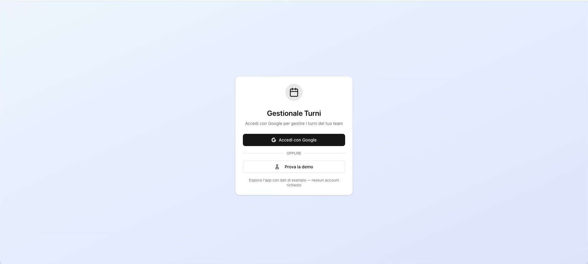
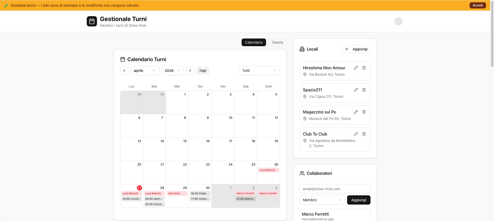
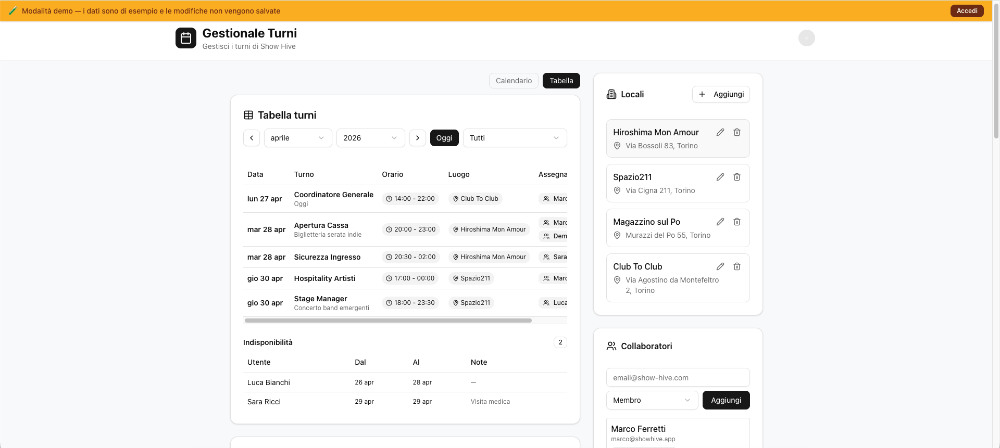
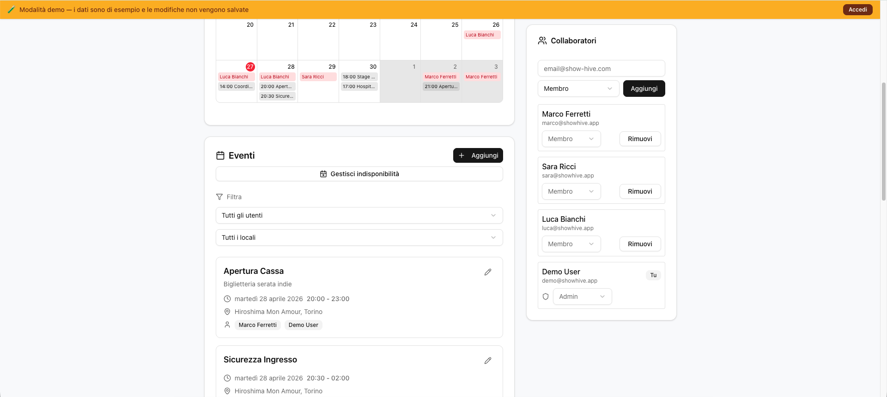

# ShowHive — Shift Management Platform

> A modern, invite-only web application for scheduling and managing work shifts, built with Next.js, Supabase, and Google Calendar integration.

---

## Live Demo

🌐 https://show-hive-gestionale.vercel.app/

## Preview






## Table of Contents

- [Overview](#overview)
- [Features](#features)
- [Tech Stack](#tech-stack)
- [Architecture](#architecture)
- [Database Schema](#database-schema)
- [Project Structure](#project-structure)
- [Getting Started](#getting-started)
  - [Prerequisites](#prerequisites)
  - [1. Clone the repository](#1-clone-the-repository)
  - [2. Install dependencies](#2-install-dependencies)
  - [3. Set up Supabase](#3-set-up-supabase)
  - [4. Set up Google Calendar integration](#4-set-up-google-calendar-integration)
  - [5. Configure environment variables](#5-configure-environment-variables)
  - [6. Run the development server](#6-run-the-development-server)
- [First-Time Bootstrap](#first-time-bootstrap)
- [Environment Variables](#environment-variables)
- [Google Calendar Setup](#google-calendar-setup)
- [Authentication & Authorization](#authentication--authorization)
- [API Reference](#api-reference)
- [Roles & Permissions](#roles--permissions)
- [Admin Guide: Managing the System](#admin-guide-managing-the-system)
- [Demo Mode](#demo-mode)
- [Maintenance & Operations](#maintenance--operations)
- [Deployment](#deployment)
- [Best Practices](#best-practices)
- [Contributing](#contributing)

---

## Overview

**ShowHive** (`show-hive-gestionale`) is a closed-access shift management platform designed for coordinating teams across multiple venues — such as event production crews, venue staff, or touring production teams. It provides a collaborative interface where administrators manage venues, create and assign shifts, track team member availability, and automatically sync all schedules with a centralized Google Calendar. Team members can view their assigned shifts, declare periods of unavailability, and manage their profiles.

### Core Workflow

1. **Admin** creates venues (location catalog)
2. **Admin/Member** creates shifts at specific venues, assigns team members, and sets a date/time
3. **System** validates that no assignee is marked unavailable on the shift date
4. **System** automatically creates a Google Calendar event and sends email invites to all assignees
5. **Team members** can view the calendar, see their assignments, and mark dates when they're unavailable
6. **Real-time sync**: Any changes to shifts (edits, deletions, reassignments) are reflected on the Google Calendar immediately

**Authentication & Access Control:** Google OAuth handles authentication — only users on the whitelist (`allowed_users` table) can log in. Permissions are split into two roles: `admin` (full control) and `member` (manage own availability, view calendar).

---

## Features

- **Google OAuth login** — passwordless sign-in; only whitelisted emails can access the app.
- **Shift management** — create, edit, and delete shifts with title, description, date, start/end time, and venue.
- **Multi-assignee support** — assign multiple team members to a single shift.
- **Venue management** — maintain a list of venues (name, address, city) used across shifts.
- **Unavailability tracking** — members can mark date ranges when they are unavailable; the system blocks scheduling them on those days.
- **Google Calendar sync** — shifts are automatically created as events on a centralized Google Calendar, with email invitations sent to all assignees. Edits and deletions are synced in real time.
- **Confirmation dialogs** — all destructive actions (delete shift, remove unavailability, delete venue) require confirmation to prevent accidental data loss.
- **Calendar view** — interactive monthly grid showing shifts and unavailabilities at a glance.
- **Table view** — spreadsheet-style alternative view for detailed shift review and management.
- **Role-based access control** — two roles (`admin` and `member`) with fine-grained Supabase RLS policies to enforce data isolation and action limits.
- **Demo mode** — a fully interactive preview of the app with realistic mock data, accessible from the login page without any account. No database writes are performed; all mutation attempts show an informational toast.
- **Dark/light theme** — powered by `next-themes`.
- **Responsive design** — works on desktop and mobile.

---

## Tech Stack

| Layer | Technology |
|---|---|
| Framework | [Next.js 16](https://nextjs.org/) (App Router) |
| Language | TypeScript 5 |
| Styling | Tailwind CSS 4 |
| UI Components | [shadcn/ui](https://ui.shadcn.com/) + Radix UI primitives |
| Icons | [Lucide React](https://lucide.dev/) |
| Forms | React Hook Form + Zod |
| Backend / DB | [Supabase](https://supabase.com/) (PostgreSQL + Auth + RLS) |
| Calendar sync | [Google Calendar API](https://developers.google.com/calendar) via `googleapis` |
| Date utilities | `date-fns` + `react-day-picker` |
| Analytics | Vercel Analytics |
| Package manager | [pnpm](https://pnpm.io/) |

---

## Architecture

```
Browser
  │
  ▼
Next.js App Router (server components + client components)
  │
  ├── /app/auth/*          ← OAuth callback, login page, unauthorized page
  ├── /app/dashboard/*     ← Main application page (server-rendered)
  ├── /app/setup/*         ← Google Calendar configuration guide
  └── /app/api/*           ← REST API routes (Next.js Route Handlers)
        ├── /shifts          ← CRUD + Google Calendar sync
        ├── /venues          ← CRUD
        ├── /members         ← Allowed users management
        ├── /unavailabilities← Unavailability periods
        └── /profile         ← User profile update

Supabase (PostgreSQL)
  ├── auth.users           ← Managed by Supabase Auth
  ├── public.profiles      ← User profile data (synced via trigger)
  ├── public.allowed_users ← Whitelist with roles
  ├── public.venues        ← Venue catalog
  ├── public.shifts        ← Shift records
  ├── public.shift_assignees ← Many-to-many: shifts ↔ users
  └── public.unavailabilities ← Unavailability date ranges

Google Calendar API
  └── Central calendar (`ADMIN_GOOGLE_CALENDAR_ID`)
        ← Events created/updated/deleted server-side
        ← Invites sent to assignees via sendUpdates: "all"
```

The application runs entirely server-side for data fetching (dashboard page uses async Server Components). Mutations go through Next.js API Route Handlers, which authenticate the caller, enforce authorization, update the database, and — where applicable — sync with Google Calendar.

---

## Database Schema

### `profiles`
Automatically populated when a user first signs in (via a PostgreSQL trigger on `auth.users`).

| Column | Type | Notes |
|---|---|---|
| `id` | `uuid` | FK → `auth.users.id` |
| `email` | `text` | |
| `full_name` | `text` | From Google OAuth metadata |
| `avatar_url` | `text` | From Google OAuth metadata |
| `created_at` | `timestamptz` | |
| `updated_at` | `timestamptz` | |

### `allowed_users`
Whitelist of users permitted to access the app, with their role.

| Column | Type | Notes |
|---|---|---|
| `id` | `uuid` | PK |
| `email` | `text` | Unique |
| `role` | `text` | `'admin'` or `'member'` |
| `created_by` | `uuid` | FK → `auth.users.id` |
| `created_at` | `timestamptz` | |

A database trigger (`ensure_admin_exists_trigger`) prevents the last admin from being removed or downgraded.

### `venues`
Locations where shifts can take place.

| Column | Type | Notes |
|---|---|---|
| `id` | `uuid` | PK |
| `name` | `text` | |
| `address` | `text` | |
| `city` | `text` | |
| `created_by` | `uuid` | FK → `auth.users.id` |
| `created_at` / `updated_at` | `timestamptz` | |

### `shifts`

| Column | Type | Notes |
|---|---|---|
| `id` | `uuid` | PK |
| `venue_id` | `uuid` | FK → `venues.id` (cascade delete) |
| `assigned_to` | `uuid` | FK → `profiles.id` (legacy single-assignee, set null on delete) |
| `title` | `text` | |
| `description` | `text` | |
| `shift_date` | `date` | |
| `start_time` | `time` | |
| `end_time` | `time` | |
| `google_calendar_event_id` | `text` | Stored after calendar sync |
| `created_by` | `uuid` | FK → `auth.users.id` |
| `created_at` / `updated_at` | `timestamptz` | |

### `shift_assignees`
Junction table for multi-assignee support.

| Column | Type | Notes |
|---|---|---|
| `shift_id` | `uuid` | FK → `shifts.id` (cascade) |
| `user_id` | `uuid` | FK → `profiles.id` (cascade) |
| `created_at` | `timestamptz` | |

Primary key: `(shift_id, user_id)`.

### `unavailabilities`

| Column | Type | Notes |
|---|---|---|
| `id` | `uuid` | PK |
| `user_id` | `uuid` | FK → `profiles.id` (cascade) |
| `start_date` | `date` | |
| `end_date` | `date` | |
| `reason` | `text` | Optional |
| `created_at` / `updated_at` | `timestamptz` | |

---

## Project Structure

```
show-hive/
├── app/
│   ├── api/
│   │   ├── members/          # GET (list), POST (add); [id]/ PATCH, DELETE
│   │   ├── profile/          # PUT (update own profile)
│   │   ├── shifts/           # POST (create); [id]/ PUT, DELETE
│   │   │   └── [id]/assignees/ # GET (fetch assignee list)
│   │   ├── unavailabilities/ # GET, POST; [id]/ PUT, DELETE
│   │   └── venues/           # POST; [id]/ PUT, DELETE
│   ├── auth/
│   │   ├── callback/         # OAuth redirect handler
│   │   ├── login/            # Login page
│   │   └── unauthorized/     # Access denied page
│   ├── dashboard/            # Main dashboard (server component)
│   ├── setup/                # Google Calendar setup guide
│   ├── globals.css
│   ├── layout.tsx
│   └── page.tsx              # Root redirect → /dashboard
├── components/
│   ├── dashboard/
│   │   ├── dashboard-header.tsx
│   │   ├── dashboard-view.tsx
│   │   ├── shifts-calendar.tsx
│   │   ├── shifts-list.tsx
│   │   ├── shifts-table-view.tsx
│   │   ├── venues-list.tsx
│   │   ├── members-card.tsx
│   │   ├── create-shift-dialog.tsx
│   │   ├── edit-shift-dialog.tsx
│   │   ├── create-venue-dialog.tsx
│   │   ├── edit-venue-dialog.tsx
│   │   ├── edit-profile-dialog.tsx
│   │   └── mark-unavailable-dialog.tsx
│   ├── ui/                   # shadcn/ui component library
│   └── theme-provider.tsx
├── hooks/
│   ├── use-mobile.ts
│   └── use-toast.ts
├── lib/
│   ├── authz.ts              # Authorization helpers (requireAllowed, requireAdmin)
│   ├── demo-data.ts          # Mock data for demo mode (shifts, venues, members, unavailabilities)
│   ├── google.ts             # Google API client factory
│   ├── google-calendar.ts    # Calendar CRUD helpers
│   ├── supabase/
│   │   ├── admin.ts          # Supabase service-role client (bypasses RLS)
│   │   ├── client.ts         # Browser client
│   │   ├── middleware.ts     # Session refresh middleware
│   │   └── server.ts         # Server-side client
│   └── utils.ts              # cn() and other utilities
├── types/
│   └── index.ts              # TypeScript type definitions
├── scripts/
│   ├── 001_create_tables.sql
│   ├── 002_profile_trigger.sql
│   └── 003_allowed_users.sql
├── styles/
│   └── globals.css
├── proxy.ts                  # Next.js proxy entry point
├── next.config.mjs
├── tsconfig.json
├── components.json           # shadcn/ui config
└── package.json
```

---

## Getting Started

### Prerequisites

- **Node.js** ≥ 20.9.0
- **[pnpm](https://pnpm.io/)** (recommended) or npm
- A [Supabase](https://supabase.com/) project
- A [Google Cloud](https://console.cloud.google.com/) project with the **Google Calendar API** enabled and OAuth credentials configured

---

### 1. Clone the repository

```bash
git clone <repository-url>
cd show-hive
```

### 2. Install dependencies

```bash
pnpm install
```

### 3. Set up Supabase

1. Create a new project at [supabase.com](https://supabase.com).
2. In the Supabase SQL editor, run the migration scripts **in order**:

```sql
-- Run each file in sequence:
scripts/001_create_tables.sql
scripts/002_profile_trigger.sql
scripts/003_allowed_users.sql
```

3. In your Supabase project, go to **Authentication → Providers → Google** and enable Google OAuth. You will need a Google OAuth Client ID and Secret (see next section).

4. Set the redirect URL in Supabase Auth to:
   ```
   https://<your-domain>/auth/callback
   ```

5. Copy your **Project URL** and **anon key** from **Settings → API**.

---

### 4. Set up Google Calendar integration

See the in-app guide at `/setup`, or follow these steps:

1. Go to [Google Cloud Console → APIs & Services → Credentials](https://console.cloud.google.com/apis/credentials).
2. Create an **OAuth 2.0 Client ID** (Web application). Add your domain (and `http://localhost:3000` for local development) to the authorized origins/redirect URIs.
3. Enable the **Google Calendar API** under Library.
4. Use [Google OAuth Playground](https://developers.google.com/oauthplayground) to obtain a **refresh token** for the central admin Google account (for example the shared calendar owner, or your own admin email):
   - In the playground settings, check **"Use your own OAuth credentials"** and enter your Client ID and Secret.
   - Authorize the scope `https://www.googleapis.com/auth/calendar`.
   - Exchange the authorization code and copy the `refresh_token`.

---

### 5. Configure environment variables

Create a `.env.local` file at the root of the project:

```env
# Supabase
NEXT_PUBLIC_SUPABASE_URL=https://<your-project-ref>.supabase.co
NEXT_PUBLIC_SUPABASE_ANON_KEY=<your-anon-key>
SUPABASE_SERVICE_ROLE_KEY=<your-service-role-key>

# Google OAuth (for user login — configured in Supabase Auth)
# These are entered directly in the Supabase dashboard, not here.

# Google Calendar (server-side only — for the central calendar account)
ADMIN_GOOGLE_CLIENT_ID=<your-oauth-client-id>
ADMIN_GOOGLE_CLIENT_SECRET=<your-oauth-client-secret>
ADMIN_GOOGLE_REFRESH_TOKEN=<refresh-token-for-admin-account>
ADMIN_GOOGLE_CALENDAR_ID=<calendar-id-or-email>
NEXT_PUBLIC_ADMIN_GOOGLE_CALENDAR_ID=<same-calendar-id-for-setup-page>
```

> ⚠️ **Security note:** Never commit `.env` or `.env.local` to version control. The `SUPABASE_SERVICE_ROLE_KEY` and Google credentials are sensitive and must be kept server-side only.

---

### 6. Run the development server

```bash
pnpm dev
```

Open [http://localhost:3000](http://localhost:3000). You will be redirected to the login page.

---

## ⚠️ First-Time Bootstrap

**Before you can use the dashboard for the first time**, you must manually insert the first admin user into the `allowed_users` table. The application redirects non-whitelisted users to `/auth/unauthorized`, so the initial setup cannot be done via the UI.

### Bootstrap Steps

1. Sign in to your **Supabase project** (https://supabase.com/dashboard)
2. Go to **SQL Editor**
3. Run this query (replace with the actual admin email):

```sql
INSERT INTO public.allowed_users (email, role)
VALUES ('your-admin-email@example.com', 'admin');
```

4. Sign in to the app at [http://localhost:3000](http://localhost:3000) with that Google account
5. You will now have access to the dashboard as an admin
6. From the dashboard, use the **Members** card to add other team members and assign their roles

> **Important:** There must always be at least one admin. The database enforces this via the `ensure_admin_exists_trigger` trigger — you cannot remove the last admin or downgrade the only admin to `member` role.

---

## Environment Variables

| Variable | Required | Description |
|---|---|---|
| `NEXT_PUBLIC_SUPABASE_URL` | ✅ | Your Supabase project URL |
| `NEXT_PUBLIC_SUPABASE_ANON_KEY` | ✅ | Supabase anonymous/public key |
| `SUPABASE_SERVICE_ROLE_KEY` | ✅ | Supabase service role key (server only) |
| `ADMIN_GOOGLE_CLIENT_ID` | ✅ | OAuth 2.0 Client ID for Google Calendar |
| `ADMIN_GOOGLE_CLIENT_SECRET` | ✅ | OAuth 2.0 Client Secret |
| `ADMIN_GOOGLE_REFRESH_TOKEN` | ✅ | Refresh token for the central calendar account |
| `ADMIN_GOOGLE_CALENDAR_ID` | ✅ | Google Calendar ID or calendar owner email used for event sync |
| `NEXT_PUBLIC_ADMIN_GOOGLE_CALENDAR_ID` | Optional | Calendar ID shown in the `/setup` page only |

---

## Google Calendar Setup

ShowHive uses a **server-side, single-account** approach for Google Calendar. All calendar events are created on one central Google account (the "admin calendar account"). This means:

- **No per-user consent required** — users do not need to authenticate with Google; the server acts on their behalf.
- **Server authentication** — the server authenticates as the admin calendar account using a long-lived refresh token (set in `ADMIN_GOOGLE_REFRESH_TOKEN`).
- **Automatic event creation & sync** — when a shift is created or updated with assignees, an event is inserted on the central calendar and email invitations are sent to all assignees automatically.
- **Real-time updates** — when a shift is edited (time, venue, assignees) or deleted, the corresponding calendar event is updated or removed.
- **Centralized visibility** — the admin calendar owner sees all shift events in their Google Calendar; assignees see invitations and can accept/decline.

### How to Obtain the Admin Refresh Token

The refresh token is required to authenticate the server as the admin calendar account. You obtain it once via Google OAuth Playground:

1. Go to [Google OAuth Playground](https://developers.google.com/oauthplayground)
2. In the **settings** (gear icon), check **"Use your own OAuth credentials"** and paste your **Client ID** and **Client Secret** (from [Google Cloud Console → Credentials](https://console.cloud.google.com/apis/credentials))
3. On the left side, scroll to **Google Calendar API v3** and select the scope `https://www.googleapis.com/auth/calendar`
4. Click **Authorize APIs** and consent with the admin Google account (the one that will own the central calendar)
5. Click **Exchange authorization code for tokens**
6. Copy the `refresh_token` value and save it as `ADMIN_GOOGLE_REFRESH_TOKEN` in `.env.local`

The refresh token is long-lived and does not expire unless you revoke it manually. Store it securely and never commit it to version control.

The central calendar ID (from step 1 above, or your Google Calendar email) is stored in `ADMIN_GOOGLE_CALENDAR_ID`.

---

## Authentication & Authorization

### Authentication Flow

1. **User visits the app** → redirected to `/auth/login`
2. **User clicks "Sign in with Google"** → Supabase initiates the OAuth flow with Google
3. **Google consent screen** → user grants permission for basic profile info (email, name, avatar)
4. **Google redirects to `/auth/callback`** → Supabase exchanges the authorization code for a session
5. **Automatic profile creation** — a PostgreSQL trigger (`handle_new_user`) automatically creates a `profiles` row with user metadata from Google
6. **Whitelist check** — the dashboard page queries `allowed_users` for the user's email
   - ✅ **If found** → dashboard renders with the user's data and assigned role
   - ❌ **If not found** → redirect to `/auth/unauthorized`

### Authorization

The app enforces permissions at two layers:

| Layer | Mechanism | Example |
|---|---|---|
| **API Layer** | Route handlers use `requireAdmin()` and `requireAllowed()` checks | Only admins can call `PUT /api/venues/[id]` to edit a venue |
| **Database Layer** | Supabase Row Level Security (RLS) policies enforce row-level access | A member can only see/edit their own unavailabilities |

The `allowed_users` table is the source of truth. Users not in this table cannot access anything except the unauthorized page. Admins can add or remove members and change roles directly from the **Members** card in the dashboard.

---

## API Reference

All endpoints are under `/app/api/` and follow Next.js Route Handler conventions. They require the caller to have an active Supabase session (cookie-based).

### Shifts — `/api/shifts`

| Method | Path | Auth | Description |
|---|---|---|---|
| `POST` | `/api/shifts` | Member | Create a shift; triggers Google Calendar event |
| `PUT` | `/api/shifts/[id]` | Member (creator, assignee, or admin) | Update shift; syncs calendar event |
| `DELETE` | `/api/shifts/[id]` | Member (creator, assignee, or admin) | Delete shift; removes calendar event |
| `GET` | `/api/shifts/[id]/assignees` | Member | Return the assignee list for one shift |

**POST/PUT body fields:**

```json
{
  "title": "string",
  "description": "string (optional)",
  "venue_id": "uuid",
  "shift_date": "YYYY-MM-DD",
  "start_time": "HH:MM",
  "end_time": "HH:MM",
  "assignees": ["uuid", "uuid"]
}
```

The API checks unavailability for all assignees and returns `400` if any assignee is unavailable on the shift date.

### Venues — `/api/venues`

| Method | Path | Auth | Description |
|---|---|---|---|
| `POST` | `/api/venues` | Member | Create a venue |
| `PUT` | `/api/venues/[id]` | Admin | Update a venue |
| `DELETE` | `/api/venues/[id]` | Admin | Delete a venue |

### Members — `/api/members`

| Method | Path | Auth | Description |
|---|---|---|---|
| `GET` | `/api/members` | Admin | List all allowed users |
| `POST` | `/api/members` | Admin | Add a new allowed user |
| `PATCH` | `/api/members/[id]` | Admin | Update role |
| `DELETE` | `/api/members/[id]` | Admin | Remove a user from the whitelist |

### Unavailabilities — `/api/unavailabilities`

| Method | Path | Auth | Description |
|---|---|---|---|
| `GET` | `/api/unavailabilities` | Member | List all unavailability periods |
| `POST` | `/api/unavailabilities` | Member | Declare own unavailability |
| `PUT` | `/api/unavailabilities/[id]` | Owner | Update own period |
| `DELETE` | `/api/unavailabilities/[id]` | Owner | Remove own period |

### Profile — `/api/profile`

| Method | Path | Auth | Description |
|---|---|---|---|
| `PUT` | `/api/profile` | Self | Update `profiles.full_name` from `first_name` and `last_name` |

---

## Roles & Permissions

| Action | `member` | `admin` |
|---|---|---|
| View dashboard | ✅ | ✅ |
| Create shifts | ✅ | ✅ |
| Edit/delete own shifts | ✅ | ✅ |
| Edit/delete assigned shifts | ✅ | ✅ |
| Edit/delete any shift | ❌ | ✅ |
| Create venues | ✅ | ✅ |
| Edit/delete venues | ❌ | ✅ |
| Manage unavailabilities (own) | ✅ | ✅ |
| View all unavailabilities | ✅ | ✅ |
| View members list | ❌ | ✅ |
| Add/remove members | ❌ | ✅ |
| Change member roles | ❌ | ✅ |

Permissions are enforced both at the API layer (via `requireAdmin` / `requireAllowed`) and at the database layer via Supabase Row Level Security policies. Note that some reads in the dashboard are done server-side with the service-role client rather than through public `GET /api/*` endpoints.

---

## Demo Mode

### Overview

ShowHive includes a fully interactive demo mode for anyone to explore the application **without authentication or database access**. It's perfect for:
- Sharing with stakeholders, recruiters, or potential users
- Testing the UI without setting up a database
- Understanding the app workflow before committing to deployment

### How It Works

The demo is activated by navigating to the dashboard with `?demo=true`:

```
http://localhost:3000/dashboard?demo=true
```

Or by clicking **"Prova la demo"** on the login page.

**What happens:**
1. The middleware detects `?demo=true` and **skips authentication checks**
2. The dashboard renders with **hardcoded mock data** (4 venues, 10 shifts, 4 team members, 3 unavailability periods)
3. All UI controls remain **fully interactive** — buttons work, dialogs open, forms display
4. **Data mutations are intercepted** — attempting to create/edit/delete anything shows a Sonner toast: *"Modalità demo — Le modifiche non vengono salvate in demo."*
5. A **sticky amber banner** at the top reminds users they're in demo mode and provides a link back to login

**No data writes occur.** Demo mode never touches the database and never calls any `/api/*` route. All state changes happen in-memory only.

### Demo Data Content

The mock dataset includes:
- **4 venues**: Hiroshima Mon Amour, Spazio211, Magazzino sul Po, Club To Club (all in Turin)
- **10 shifts**: Spread across upcoming dates, with realistic roles (Apertura Cassa, Sicurezza Ingresso, Stage Manager, Bar, etc.)
- **4 team members**: Marco Ferretti, Sara Ricci, Luca Bianchi, + Demo User (as admin)
- **3 unavailability periods**: Vacation, medical visit, and personal time for different users

This makes the demo realistic enough to evaluate the system's capabilities.

### Implementation Details

| File | Role |
|---|---|
| `lib/demo-data.ts` | Hardcoded mock data — venues, shifts, users, unavailabilities |
| `lib/supabase/middleware.ts` | Skips auth redirect when `?demo=true` is detected |
| `app/dashboard/page.tsx` | Branches on `searchParams.demo`; returns mock data instead of Supabase queries |
| `components/dashboard/dashboard-view.tsx` | Accepts `isDemo` prop; renders the sticky demo banner |
| `components/dashboard/shifts-list.tsx`, `venues-list.tsx`, `members-card.tsx` | Action buttons show toast if `isDemo` instead of opening dialogs |

### Security Notes

- Demo mode is **entirely client-side** and read-only
- No Supabase session cookie is created or required
- No database queries are executed
- Mock data is static fictional data — no real user or business data is exposed
- Safe to use in public or share broadly

---

## Admin Guide: Managing the System

Once the app is deployed, admins manage the system from the dashboard. Here's the typical workflow:

### Adding Team Members

1. Go to the **Members** card (right panel)
2. Click **"Add Member"** and enter the team member's email address
3. Set their role:
   - `member` — can view calendar, create/edit own shifts, mark unavailability
   - `admin` — full access, can edit any shift, manage members, manage venues

The team member can then log in with their Google account and will have access immediately.

### Creating Shifts

1. Click the **"+ New Shift"** button
2. Fill in shift details:
   - **Title** — role or task (e.g., "Apertura Bar", "Stage Manager")
   - **Venue** — select from the venue list
   - **Date** — pick from the date picker
   - **Time** — start and end times
   - **Assignees** — select team members (multi-select allowed)
3. **Confirmation** — the system checks if any assignee is unavailable on that date and warns you
4. **Sync** — upon creation, a Google Calendar event is created and invites are sent to assignees

### Managing Unavailability

Team members can declare their unavailability in two ways:

1. **Self-service** — click **"Mark Unavailable"** in the dashboard, pick date range and reason (e.g., "vacation", "medical appointment")
2. **Admin override** — (future feature) admins may manage member unavailability

When a shift is created or edited, the system checks against all unavailabilities and will warn if an assignee conflicts.

### Editing Shifts

- Click the shift in the calendar or list to open the edit dialog
- You can change the title, venue, time, or reassign team members
- **Permission check:**
  - `member` — can only edit shifts they created or are assigned to
  - `admin` — can edit any shift
- Confirmation dialog confirms the action before applying
- Changes sync to Google Calendar automatically

### Deleting Shifts

- Click **Delete** on a shift
- A confirmation dialog appears to prevent accidents
- Upon confirmation, the shift and its Google Calendar event are removed
- Assignees are no longer invited to the event

### Managing Venues

- **Admin only** can create, edit, or delete venues
- Venues are a catalog (address, city) reused across shifts
- Deleting a venue cascades to delete all shifts at that venue

---

## Maintenance & Operations

### GitHub Actions: Supabase Keep-Alive

The repository includes a GitHub Actions workflow (`.github/workflows/keep-alive.yml`) that **pings your Supabase project every 3 days** to keep it active. This prevents Supabase free-tier projects from being auto-paused due to inactivity.

**How it works:**
- Cron schedule: `0 8 */3 * *` (every 3 days at 08:00 UTC)
- Action: Makes a simple API call to your Supabase project
- Secrets required: `SUPABASE_URL` and `SUPABASE_ANON_KEY`

**To enable it on your fork:**
1. Go to **Repository Settings → Secrets and variables → Actions**
2. Add `SUPABASE_URL` (your Supabase project URL)
3. Add `SUPABASE_ANON_KEY` (your Supabase anon key)
4. The workflow will run automatically starting the next scheduled time

If you don't use this, Supabase free-tier projects may pause after 1 week of inactivity, and you'll need to manually resume them.

---

## Deployment

The application is designed to deploy on **Vercel** (the `@vercel/analytics` package is included):

1. Push the repository to GitHub/GitLab.
2. Import the project into Vercel.
3. Add all environment variables from the [Environment Variables](#environment-variables) section in the Vercel project settings.
4. Set the **Supabase redirect URL** to your Vercel production domain:
   ```
   https://<your-app>.vercel.app/auth/callback
   ```
5. Deploy. Vercel will run `pnpm build` automatically.

For other platforms, ensure the following:
- Node.js ≥ 20.9.0 runtime.
- All environment variables are set on the server (never exposed to the client).
- The server can reach `supabase.co` and `googleapis.com`.

---

## Best Practices

### For Admins

- **Venue catalog first** — create venues before shifts to keep data organized
- **Clear naming** — use consistent shift titles (e.g., "Apertura Bar", "Sicurezza", "Stage Manager") so team members understand roles at a glance
- **Confirm Google Calendar access** — ensure the admin calendar account is shared with the team or that team members check their email for shift invitations
- **Whitelist management** — regularly review the **Members** list to keep it current; remove team members who have left
- **Role assignment** — use `member` by default; only grant `admin` to trusted leads who will help manage the schedule

### For Team Members

- **Mark unavailability early** — declare dates you cannot work in advance; the system will warn admins if they try to assign you
- **Check your email** — shift invitations are sent via Google Calendar invite; accept or decline in your email or calendar app
- **Use the calendar view** — the month grid shows all your shifts and unavailability at a glance
- **Report conflicts** — if you see an impossible scheduling conflict (e.g., overlapping shifts), contact your admin immediately

### For Deployment

- **Environment variables in CI/CD** — use your platform's secrets manager (Vercel, GitHub Secrets, etc.) to store sensitive credentials; never hardcode them
- **Monitor Google Calendar quota** — if you have hundreds of shifts, monitor Google Calendar API quotas (10 QPS per user by default)
- **Database backups** — Supabase includes automatic backups; enable manual backups if you're critical to your operation
- **Test the demo** — before sharing with external stakeholders, verify the demo mode URL works as expected

1. Fork the repository and create a feature branch: `git checkout -b feature/your-feature`.
2. Make your changes and ensure TypeScript compiles: `pnpm build`.
3. Lint your code: `pnpm lint` after adding an ESLint config for the repo, or use your preferred validation flow if linting is not yet configured.
4. Open a pull request with a clear description of the changes.

> Note: `next.config.mjs` currently has `typescript.ignoreBuildErrors: true`. It is recommended to fix any TypeScript errors rather than relying on this flag in production.
